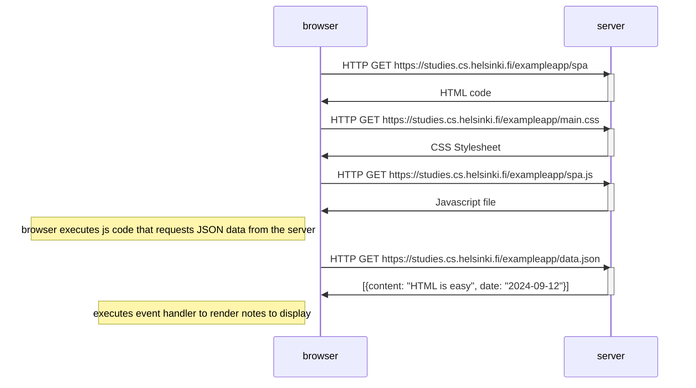

```mermaid
sequenceDiagram
    participant browser
    participant server

    browser->>server: HTTP GET https://studies.cs.helsinki.fi/exampleapp/spa
    activate server
    server->>browser: HTML code
    deactivate server

    browser->>server: HTTP GET https://studies.cs.helsinki.fi/exampleapp/main.css
    activate server
    server->>browser: CSS Stylesheet
    deactivate server

    browser->>server: HTTP GET https://studies.cs.helsinki.fi/exampleapp/spa.js
    activate server
    server->>browser: Javascript file
    deactivate server

    note left of browser: browser executes js code that requests JSON data from the server

    browser->>server: HTTP GET https://studies.cs.helsinki.fi/exampleapp/data.json
    activate server
    server->>browser: [{content: "HTML is easy", date: "2024-09-12"}]
    deactivate server

    note left of browser: executes event handler to render notes to display

```