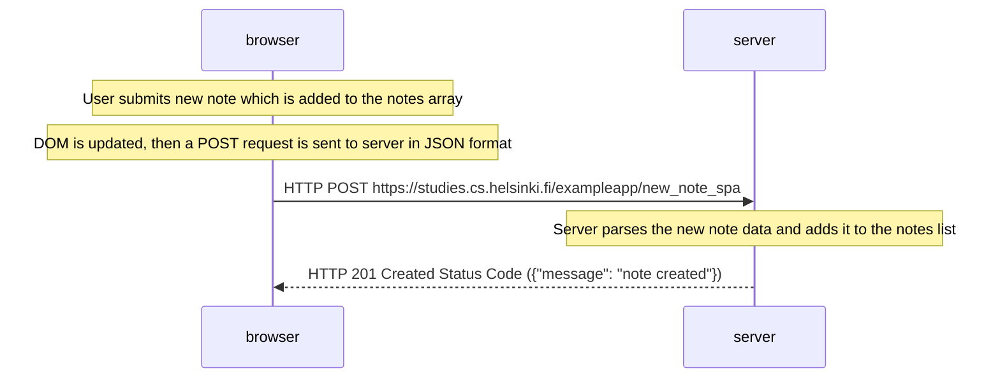

```mermaid
sequenceDiagram
    participant browser
    participant server

    note over browser: User submits new note which is added to the notes array
    note over browser: DOM is updated, then a POST request is sent to server in JSON format

    browser->>server: HTTP POST https://studies.cs.helsinki.fi/exampleapp/new_note_spa

    note over server: Server parses the new note data and adds it to the notes list

    server-->>browser: HTTP 201 Created Status Code ({"message": "note created"})
```